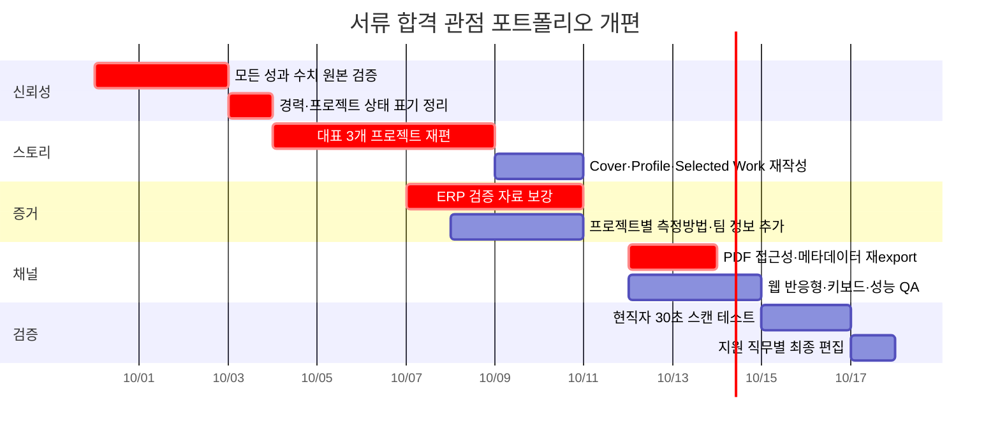

# UX/UI 디자이너 서류 불합격 원인 분석: 이한울 웹사이트·PDF 포트폴리오 채용 심사 리서치

## Executive Summary

### 결론부터 말하면

**현재 포트폴리오는 “디자인을 못해서 탈락하는 포트폴리오”가 아닙니다.** 오히려 실제 B2B·업무 시스템을 다뤄 본 경험, 복잡한 정보 구조화, 실제 제품 UI, Before/After, IA, 역할별 View, 프론트엔드 구현 경험까지 갖고 있어 일반적인 주니어 포트폴리오보다 실무 밀도가 높습니다. PDF 36페이지 전체를 확인했을 때 이 강점은 분명합니다. fileciteturn0file0

그런데 **서류 심사에서 더 치명적인 세 가지 문제가 동시에 있습니다.**

첫째는 **수치의 신뢰성**입니다. 18페이지의 `n=15` 설문과 `40% / 50% / 9% / 1%` 비율은 표기된 조건대로 단일 응답 15명의 결과라면 산술적으로 성립하지 않습니다. 19페이지 프로젝트 표지의 `이탈률 25% 감소·전환율 30% 향상`은 같은 프로젝트 결론인 28페이지에서 근거가 이어지지 않고, 대신 `주요 정보 탐색 5.4회 → 약 2회`, `과제 평가 85.6점`이 결과로 제시됩니다. 13페이지의 `이용률 43% 증가·모바일 활용 2.1배·만족도 4.6/5.0`도 산출 근거나 기준 시점이 보이지 않습니다. **숫자가 없는 것보다, 설명되지 않거나 서로 연결되지 않는 숫자가 훨씬 위험합니다.** UX 벤치마킹에서는 지표, 측정 방법, 기준선, 대상, 시점을 함께 기록해야 결과를 방어할 수 있다는 것이 NN/g의 권고입니다. citeturn19search1turn19search3

둘째는 **“6년차 UX/UI 디자이너”라는 포지셔닝과 포트폴리오가 증명하는 경력의 결이 약간 어긋납니다.** PDF상 디지털 디자인 경력은 2020년 9월부터라 현재 약 6년이 맞지만, Product Designer 경력은 2022년 12월부터라 약 3년 9개월입니다. fileciteturn0file0 현재 국내 Product Designer 공고에서는 단순 총 디자인 연차가 아니라 모바일·웹 Product Design 경력을 별도로 요구하는 경우가 있고, LINE Pay의 2026년 공고 역시 3년 이상의 모바일/웹 디자인 경력, 프로토타이핑, Structure/Flow, 디자인 시스템 등을 명시합니다. citeturn20search7turn20search9 따라서 5~6년급 PD 공고에 지원하면 심사자는 현재 포트폴리오에서 **“6년차에게 기대하는 사업 영향력·제품 전략·조직 협업·출시 후 지표”**를 찾게 되는데, 현재 자료는 그보다는 **3~4년차 Product Designer의 강한 실행력**을 더 잘 증명합니다.

셋째는 **좋은 내용이 있는데 읽는 사람이 너무 많이 해석해야 한다는 것**입니다. 36페이지, 4개 상세 프로젝트, 반복되는 문제정의→카드→구조→결과 형식 때문에 첫 30~60초 안에 “이 사람을 왜 뽑아야 하는가”가 충분히 압축되지 않습니다. NN/g가 200명 이상의 UX 채용 담당자를 조사한 결과 직급과 직무에 따라 요구가 다르며, 포트폴리오의 첫 역할은 면접 기회를 얻도록 설득하는 것입니다. 프로젝트를 보여주는 것뿐 아니라 채용담당자가 이해할 수 있는 이야기로 만들어야 합니다. citeturn19search0turn19search8turn19search9

**제 판단으로 가장 가능성 높은 탈락 구조는 다음과 같습니다.**

> 디자인 결과물 확인 → “실무는 해봤네”  
> → 6년차라고 읽음 → “그러면 영향력과 성과는?”  
> → 수치를 봄 → “수치가 많긴 한데 측정 근거가 어디 있지?”  
> → 일부 수치 불일치 발견 → 나머지 수치까지 신뢰도 하락  
> → 36페이지 안에서 정확한 역할·팀 규모·출시 상태·비즈니스 결과를 다시 찾아야 함  
> → **비슷한 수준의 후보 중 설명이 더 명료한 지원자로 이동**

즉, 지금 필요한 것은 더 화려한 디자인이 아니라 **증거 정리 → 경력 포지셔닝 정리 → 첫 30초 정보 재설계 → PDF 기술 품질 수정**입니다.

### 가장 먼저 고쳐야 할 것

| 문제 | 위험도 | 예상 효과 | 판단 |
|---|---:|---:|---|
| 18p 설문 수치 산술 불일치 | **높음** | **매우 큼** | 신뢰 훼손 가능 |
| 19p와 28p 성과 지표 불일치 | **높음** | **매우 큼** | 허위·과장으로 오해될 위험 |
| 13p 성과 수치 출처·baseline 없음 | **높음** | **매우 큼** | 좋은 숫자가 오히려 의심 요소 |
| “6년차 UX/UI” 포지셔닝 | **높음** | **큼** | 5년+ PD 포지션에서 기대치 불일치 |
| PDF 36p 전부 이미지화 | **높음** | **큼** | 검색·복사·접근성·문서 품질 저하 |
| 대표 프로젝트 4개 모두 상세 설명 | **중간~높음** | **큼** | 첫 검토 속도 저하 |
| 프로젝트마다 팀·출시·제약·측정 방식 부족 | **높음** | **큼** | 소유권과 영향력 판단 어려움 |
| 반복적인 3카드·박스 레이아웃 | **중간** | 중간 | 템플릿 인상, 증거 밀도 저하 |
| 최근 ERP 프로젝트에 검증 결과 없음 | **높음** | 큼 | 최신 역량의 완결성이 약해짐 |
| Kanban 프로젝트 실무/개인 재구성 상태 모호 | **중간** | 큼 | 실제 출시 프로젝트로 오해 가능 |

여기서 말하는 “예상 효과”는 실제 채용공고·경쟁자·회사별 기준이 없기 때문에 허위로 합격률 퍼센트를 만들지 않고 **매우 큼 / 큼 / 중간 / 작음**으로 평가했습니다.

### 웹사이트 분석 범위에 대한 중요한 제한

공개 웹사이트와 PDF URL을 직접 여러 차례 조회했지만, 이 리서치 환경에서는 두 URL 모두 `Cache miss`로 fetch가 실패했습니다. citeturn21view0turn21view1 이는 **사이트가 실제로 장애라는 뜻이 아니라 현재 리서치 환경에서 라이브 HTML/CSS를 검증하지 못했다는 뜻**입니다.

따라서 아래에서 **PDF는 36페이지 전 페이지를 실제로 확인해 진단**하지만, 웹사이트의 화면·모바일 동작·키보드 포커스·실제 내부 페이지는 본 첨부 자료로 확인되지 않은 내용을 본 것처럼 단정하지 않습니다. 웹은 검증 가능한 URL 구조와 함께, 실제 코드/브라우저에서 반드시 확인해야 할 항목을 별도로 구분했습니다.

## 채용 심사 기준과 불합격 원인 매핑

### 채용담당자·리크루터가 먼저 보는 것

리크루터의 첫 질문은 “디자인이 예쁜가?”보다 대체로 **이 공고에 맞는 사람인가**입니다. 현재 국내 Product Designer 공고에서는 사용자 시나리오와 Flow, 인터랙션, 프로토타이핑, 디자인 시스템, 출시 경험, 접근성 같은 구체적인 실무 경험을 요구하고 있습니다. LINE의 Product Designer 공고는 사용성 분석과 지표를 바탕으로 과제를 정의하고 프로토타이핑하는 역할을 설명하며, LINE Pay의 2026년 공고는 Structure/Flow 설계, AI 활용 프로토타입, 디자인 시스템 기반 UI를 명시합니다. citeturn20search4turn20search9 토스 역시 디자인 문제를 풀어가는 과정과 본인의 생각이 담긴 포트폴리오를 명시적으로 선호한다고 설명합니다. citeturn20search1

현재 자료를 그 관점에서 읽으면 다음과 같습니다.

| 심사자 | 확인하려는 것 | 현재 포트폴리오의 강점 | 현재 위험 |
|---|---|---|---|
| 리크루터 | 연차·직무·산업·툴·대표성과 | B2B, ERP, 모바일, 대형 플랫폼, 구현 경험 | “6년 Product Designer인가?”가 즉시 명확하지 않음 |
| 디자인 리드 | 문제정의→판단→설계→검증 논리 | IA, 역할별 View, Before/After, UI 대안 비교 | 리서치 방법·측정 근거가 부족하거나 일부 수치 불일치 |
| Product/사업 리드 | 제품에 미친 영향 | 클릭 감소, 이용률 등 성과를 제시하려는 시도 | 비즈니스 지표와 UX 지표의 출처·인과관계가 불명확 |
| 실무 디자이너 | UI craft·디테일·시스템 사고 | 실제 화면 퀄리티와 복잡한 정보 구조화가 좋음 | 큰 화면 캡처가 작아 세부 UI 검토가 어려운 장면 존재 |
| 개발 협업 관점 | 구현 가능성·handoff·constraint | HTML/SCSS/JS, 퍼블리싱, 직접 구현은 강한 차별점 | “무엇을 구현해 어떤 위험을 줄였는지”가 더 구체적이어야 함 |

### 현재 포트폴리오의 실제 경쟁력

가장 중요한 것은 **당신의 강점을 잘못 정의하지 않는 것**입니다.

현재 포트폴리오의 핵심 경쟁력은 “예쁜 UI를 잘 만드는 디자이너”도, “리서치 전문 UX 디자이너”도 아닙니다.

제가 36페이지를 보고 내리는 가장 정확한 포지셔닝은:

> **복잡한 B2B 업무와 데이터 구조를 이해하고, 사용자의 정보 탐색·판단·실행 흐름으로 재구성하며, 필요하면 실제 프론트엔드 구현 수준까지 내려가는 Product Designer**

입니다. fileciteturn0file0

이건 꽤 좋은 포지션입니다. 특히 현재 LINE Pay 같은 공고에서도 프로토타입 제작과 생산성, Structure/Flow, 디자인 시스템이 동시에 요구되고 있고, 토스도 B2B·생산성 제품의 시각 품질과 컴포넌트 문제를 다루는 역할을 별도로 강조하고 있습니다. citeturn20search9turn20search1

문제는 PDF 첫 페이지 문장인

> “복잡한 정보와 반복되는 업무를 구조화해 사용자가 더 빠르고 명확하게 판단할 수 있는 제품 경험을 설계합니다.”

가 방향은 맞지만 **너무 많은 UX 디자이너에게 적용 가능한 문장**이라는 점입니다. fileciteturn0file0

여기에 `B2B`, `업무 시스템`, `Data UX`, `구현 검증`을 넣으면 채용시장에서 훨씬 선명해집니다.

### 가장 위험한 연차 포지셔닝

PDF에는 Web Designer 경력 `2020.09–2022.12`, Product Designer 경력 `2022.12–Present`가 기재되어 있습니다. fileciteturn0file0

2026년 9월 기준으로 보면:

- 디지털 디자인 전체 경력: 약 6년
- Product Designer 직함 경력: 약 3년 9개월

입니다.

따라서 **“6년차 UX/UI 디자이너” 하나로만 말하면 지원하는 공고에 따라 손해를 볼 수 있습니다.**

5년 이상의 Product Design 경력을 명시하는 회사는 실제 Product Design 경력을 좁게 해석할 수 있습니다. 예를 들어 LINE의 5년 이상 Product Designer 공고는 5년 이상의 Mobile UI Design/Product Design 경험을 별도로 요구합니다. citeturn20search0 반면 현재 LINE Pay 공고처럼 3년 이상의 모바일/웹 디자인 경력을 요구하는 포지션이라면 지금 경력은 상당히 자연스럽게 들어맞습니다. citeturn20search9

그래서 표현을 다음처럼 바꾸는 것이 안전합니다.

**현재**
> 6년 차 UX/UI 디자이너 이한울입니다.

**권장**
> 디지털 프로덕트 디자인 경력 약 6년, Product Designer로 3년 9개월간 B2B 업무 제품을 설계해온 이한울입니다.

또는 더 짧게:

> **6년간 디지털 제품을 디자인했고, 최근 3년 9개월은 B2B Product Design에 집중했습니다.**

이렇게 쓰면 경력을 낮춰 보이는 것이 아니라 오히려 **신뢰가 올라갑니다.**

## PDF 전 페이지 냉정 진단

PDF는 36페이지 전체를 확인했습니다. fileciteturn0file0

### 전체적인 첫인상

시각적 완성도는 **서류 탈락의 주원인이 아닙니다.**

좋은 점이 분명합니다.

전체적으로 16:9 프레젠테이션 시스템이 일관되고, 타이포그래피의 위계도 안정적입니다. 프로젝트별로 실제 제품 화면이 충분히 들어가 있고, ERP의 Before/After, 모바일 업무 화면, 지도 플랫폼, Kanban 등 결과물의 종류도 다양합니다. 무엇보다 **학생 프로젝트 느낌이 적고 실제 업무 도메인 경험이 보입니다.** fileciteturn0file0

특히 좋은 페이지는:

- **11p** ERP Before/After
- **16–17p** 모바일 회의실·전자결재 Before/After
- **23–25p** 대형 플랫폼의 지도 UI와 UI 대안 비교
- **31–34p** Kanban 구조 선택→구현→사용성 테스트

입니다. fileciteturn0file0

반대로 현재 디자인에서 중간 수준의 문제는 **동일한 큰 제목 + 짧은 설명 + 3개의 둥근 카드** 패턴이 너무 자주 반복된다는 점입니다. 6, 7, 10, 20, 21, 30, 31페이지 등에서 정보의 성격보다 레이아웃 문법이 먼저 반복됩니다. fileciteturn0file0

따라서 전체 리디자인은 필요 없습니다. **실제 제품 화면과 증거가 있는 페이지는 더 크게, 설명만 반복하는 카드는 줄이는 쪽**이 맞습니다.

### 전 페이지 진단

| 페이지 | 현재 역할 | 냉정한 평가 | 수정 우선순위 |
|---|---|---|---:|
| **1** | Cover | 문장은 좋지만 B2B/Data/구현이라는 고유성이 약함 | 높음 |
| **2** | Career/Profile | 실무 폭은 좋음. 연차 정의·학력 표현·핵심 성과가 한 화면에 밀집 | 높음 |
| **3** | Contents | 구조는 명확하지만 상세 프로젝트 4개로 첫 검토량이 많음 | 중간 |
| **4** | ERP cover | 최신 B2B 프로젝트라 매우 중요. 100% 기여도보다 팀 구조·출시 상태가 필요 | 높음 |
| **5** | 문제 배경 | 문제 정의 좋음. `GPT Pro AI 협업`은 역할이 모호해 buzzword처럼 읽힐 수 있음 | 중간 |
| **6** | 문제 정의 | 세 문제는 명확. 다만 어떤 관찰/데이터에서 도출했는지 증거 부족 | 높음 |
| **7** | 역할별 View | 실제 엔터프라이즈 UX 사고가 잘 드러남 | 낮음 |
| **8** | IA | 매우 좋은 근거 화면. 역할→정보범위 설계를 더 강조할 가치 있음 | 낮음 |
| **9** | Visual priority | 상태·우선순위 설계가 구체적 | 낮음 |
| **10** | 개발 연결 | 구현 가능성을 고려한다는 차별점은 좋지만 실 구현 결과를 더 보여줘야 함 | 중간 |
| **11** | Before/After | 대표적인 강점 페이지. 첫 프로젝트 초반부로 더 당겨도 됨 | 낮음 |
| **12** | 회고 | 문장은 좋지만 결과/검증이 없음. 최신 프로젝트의 가장 큰 약점 | **높음** |
| **13** | 모바일 cover | 43%, 2.1배, 4.6/5 성과가 눈에 띄지만 출처가 없는 것이 치명적 | **높음** |
| **14** | 문제 정의/사용자 | 인물 구분은 좋으나 조사 방법·참여자·근거가 희미함 | 높음 |
| **15** | 목표/설문 | 37.3% 등의 데이터 출처, N, 질문 방식이 필요 | **높음** |
| **16** | 회의실 Before/After | 실제 기능 변화가 잘 보임 | 낮음 |
| **17** | 결재 Before/After | 이동 중 핵심 행동이라는 맥락이 좋음 | 낮음 |
| **18** | 설문/결과 | **현재 PDF에서 가장 위험한 페이지 중 하나** | **최상** |
| **19** | 대형 플랫폼 cover | 매우 좋은 프로젝트인데 성과 문구가 28p와 충돌 | **최상** |
| **20** | 문제 정의 | 설명은 합리적이나 일반론 수준 | 중간 |
| **21** | 사용자 역할 | 역할 분리가 명확함. 실제 인터뷰/요구수집 근거 추가 필요 | 중간 |
| **22** | IA | `5.4회 → 2회` 목표가 구체적이라 좋음. 측정법 필요 | 높음 |
| **23** | 지도 기반 UX | 제품 특성이 확실하게 느껴지는 좋은 페이지 | 낮음 |
| **24** | 정보 통합 | 파일→업무구조→플랫폼이라는 변화를 잘 설명 | 낮음 |
| **25** | UI 대안 비교 | 디자인 의사결정 증거로 매우 좋음. 평가 기준을 수치/근거화하면 더 강함 | 중간 |
| **26** | IA 개선 | 내용은 좋지만 카드식 정리보다 핵심 플로우/실제 UI가 더 효과적 | 중간 |
| **27** | UI 우선순위 | 현재→다음 행동 구조가 좋은 Product Thinking 증거 | 낮음 |
| **28** | 결과 | 실제로 강한 성과 페이지. 단 19p 지표와 불일치 해결 필수 | **최상** |
| **29** | Kanban cover | end-to-end 역량이 좋으나 실제 회사 제품/개인 재구성인지 명확히 해야 함 | 높음 |
| **30** | 문제 정의 | 명료하지만 비슷한 카드 구조 반복 | 중간 |
| **31** | 대안 비교 | 왜 Kanban인지 비교하는 과정이 좋음 | 낮음 |
| **32** | Before/After | 목록→직접 상태변경의 변화가 직관적 | 낮음 |
| **33** | 구현/검증 | **현재 시장에서 상당히 좋은 차별점**. 더 강조 필요 | 낮음 |
| **34** | 사용성 테스트 | 매우 강한 페이지. 단 측정 단위와 작은 표본의 한계를 더 정확히 표기 | 높음 |
| **35** | 추가 프로젝트 | 폭은 보이지만 Role·Year·Outcome이 없어 썸네일 모음으로 끝남 | 중간 |
| **36** | Ending | 1p 메시지 반복. 36p까지 읽은 사람에게 추가 정보가 거의 없음 | 낮음~중간 |

### 치명적인 문제: 수치의 신뢰성

#### 모바일 인트라넷 18페이지

페이지에는 설문 참여자가 **15명**이라고 쓰여 있고, 첫 질문 결과가 대략 `40% / 50% / 9% / 1% / 0%`로 보입니다. fileciteturn0file0

표기 그대로 15명이 하나의 선택지를 고른 설문이라면 한 사람은 약 **6.67%**입니다.

가능한 값은:

`0%, 6.7%, 13.3%, 20%, 26.7%, 33.3%, 40%, 46.7%, 53.3%...`

이런 식이어야 합니다.

따라서 `50%`, `9%`, `1%`는 **15명 단일 선택 응답 비율로는 나오기 어렵습니다.**

이 페이지를 디자인 리드가 발견하면 문제는 단순 오타에서 끝나지 않습니다.

> “그럼 43% 증가, 2.1배, 4.6점도 어떻게 계산했지?”

라는 의심이 생깁니다.

NN/g도 UX 효과를 보여줄 때 baseline 자체보다 중요한 것이 **어떻게, 누구를, 언제, 어떤 조건으로 측정했는지 함께 문서화하는 것**이라고 강조합니다. citeturn19search1

**해결 방법**

실제 원본 데이터부터 다시 확인해야 합니다.

예를 들어 실제 응답이 `6명 / 7명 / 1명 / 1명 / 0명`이라면:

- 매우 쉬워짐 40.0%
- 다소 쉬워짐 46.7%
- 보통 6.7%
- 다소 어려워짐 6.7%
- 매우 어려움 0%

처럼 원 데이터에 맞게 바꿔야 합니다.

원 데이터를 찾을 수 없다면 **그래프를 삭제하는 편이 낫습니다.**

#### 모바일 프로젝트 13페이지

`결재·예약 이용률 43% 증가`, `모바일 활용 2.1배`, `만족도 4.6/5.0`은 아주 좋은 숫자입니다. fileciteturn0file0

하지만 좋은 숫자는 다음 질문을 자동으로 부릅니다.

> 43%는 무엇이 43% 증가했는가?  
> 27%→70%인가, 100건→143건인가?  
> 기간은 언제인가?  
> 기능 출시 전후 동일 기간인가?  
> 모바일 활용 2.1배는 DAU인가, 업무 처리 건수인가?  
> 만족도 N은 몇 명인가?

이 중 하나도 곧바로 연결되지 않으면 **숫자가 포트폴리오 장식처럼 보입니다.**

권장 표기:

> **모바일 전자결재·회의실 예약 이용건수 +43%**  
> 출시 전 4주 vs 출시 후 안정화 4주 / 사내 로그 기준 / N=[실제 건수]

처럼 만드십시오.

실제 로그가 아니라 설문 자기보고식이면 그 사실을 그대로 적어야 합니다.

#### 대형 통합 플랫폼 19페이지와 28페이지

19페이지에는:

> 이탈률 25% 감소 · 전환율 30% 향상 · 우수 프로젝트 선정

이 표시됩니다. fileciteturn0file0

그런데 28페이지의 실제 결과는:

> 주요 정보 탐색 평균 클릭 횟수 5.4회 → 약 2회  
> 2023 XR 플래그십 건설 과제 평가 85.6점(최고점)

입니다. fileciteturn0file0

이건 상당히 큰 문제입니다.

특히 내부 업무 플랫폼에서 **‘이탈률’, ‘전환율’**이라는 표현은 무엇을 이탈하고 무엇으로 전환했는지 정의가 없으면 소비자 웹 지표를 옮겨 붙인 것처럼 읽힐 수 있습니다.

실제 데이터가 존재하지 않는다면 **19페이지의 두 수치는 바로 삭제하는 것을 권합니다.**

오히려 다음이 훨씬 강합니다.

> **주요 정보 탐색 평균 5.4회 → 약 2회**  
> **2023 XR 플래그십 건설 과제 평가 85.6점·최고점**

왜냐하면 뒤 페이지가 이미 이를 증명하기 때문입니다.

NN/g 역시 효과는 redesign 전후 동일하거나 설명 가능한 측정 조건에서 비교해야 하고, 해당 UX 지표가 사용자 또는 조직 목표와 연결되어야 한다고 설명합니다. citeturn19search3turn19search6

### 연구·프로세스는 있는데 “증거 체인”이 짧다

현재 포트폴리오는 UX Process가 없는 포트폴리오가 아닙니다.

오히려 다음은 잘 되어 있습니다.

- 사용자 역할 분류
- 문제 정의
- 정보구조
- Before/After
- UI 대안 비교
- 역할별 View
- 상태 우선순위
- 구현
- 일부 사용성 테스트

fileciteturn0file0

하지만 대부분 프로젝트에서:

> **어떻게 알게 됨 → 어떤 evidence → 그래서 어떤 decision → 결과가 어떻게 달라짐**

중 앞과 뒤가 잘려 있습니다.

예를 들어 6페이지에서 3개 UX 문제를 정의했다면 한 줄씩만 추가하면 됩니다.

**현재**
> 수동 취합으로 인한 의사결정 지연

**권장**
> PM 4명이 월간 비용회의 전 Excel 3종을 수동 취합했고, 데이터 확인에 평균 [실제 시간]이 소요되었습니다. 이를 기준으로 역할별 핵심 KPI를 한 화면에 통합했습니다.

숫자가 없다면:

> PM·관리자 요구사항 회의에서 반복적으로 등장한 “비용·인원·위험도를 한 화면에서 비교하기 어렵다”는 문제를 핵심 과제로 정의했습니다.

라고 쓰면 됩니다.

**근거 없는 숫자를 만들 필요가 전혀 없습니다.**

### “100%” 기여도 표기의 문제

여러 프로젝트 표지에 `UX/UI 디자인 100%`, `퍼블리싱 100%`가 반복됩니다. fileciteturn0file0

혼자 담당했다면 사실일 수 있습니다. 하지만 중견 지원자 포트폴리오에서는 `100%`가 오히려 팀 맥락을 지웁니다.

디자인 리드가 궁금한 것은:

- PM이 있었나?
- 개발자는 몇 명이었나?
- 요구사항은 누가 정했나?
- 본인이 문제정의에도 참여했나?
- 사용자와 직접 만났나?
- 어떤 의사결정을 본인이 소유했나?

입니다.

따라서:

**현재**
> UX/UI 디자인 100% | 기획 20%

보다

**권장**
> **Role** Sole Product Designer  
> **Team** PM 1 · Designer 1 · FE 2 · BE 2  
> **Ownership** 사용자 역할 정의, IA, 핵심 Flow, UI, prototype, FE QA  
> **Scope 제외** 사업 요구사항·백엔드 정책은 PM/개발팀 소유

가 훨씬 신뢰도 높습니다.

공동 작업에서 개인 기여도를 명확히 밝히는 것은 실제 디자인 채용에서도 중요하게 취급되며, LINE Pay 역시 협업 프로젝트에는 개인 기여도를 명시하도록 안내하는 공고를 운영하고 있습니다. citeturn20search11

### 가장 좋은 프로젝트와 가장 약한 프로젝트

**현재 가장 강력한 프로젝트는 수정 후의 3번 대규모 통합 플랫폼입니다.**

그 이유는 사용자 역할→IA→지도 중심 UI→정보 통합→대안 비교→탐색 횟수 개선→외부 평가까지 **제품 설계 이야기가 가장 완결되어 있기 때문**입니다. fileciteturn0file0

단, 19p 지표를 반드시 정리해야 합니다.

그다음은 **1번 ERP Dashboard**입니다. 가장 최근 프로젝트이고 B2B·데이터 UX라는 본인의 강점과 가장 잘 맞습니다. 다만 12페이지에서 결과가 “배운 점”으로 끝납니다. fileciteturn0file0

세 번째는 **4번 Kanban**입니다. 특히 33페이지의 실제 구현과 34페이지 사용성 테스트가 좋습니다. fileciteturn0file0 최근 Product Designer 채용이 prototyping과 end-to-end 실행을 요구하는 방향과도 잘 맞습니다. citeturn20search9

다만 29페이지 설명상 실무에서 관찰한 문제를 별도 재구성한 프로젝트로 보이므로, **실제 운영 제품으로 오해되지 않게 표지에 명시**해야 합니다.

예:

> **Independent Validation Project**  
> 실무에서 반복적으로 관찰한 업무관리 문제를 재구성해 설계·구현·테스트한 개인 검증 프로젝트

2번 모바일 인트라넷은 나쁜 프로젝트가 아니지만 **데이터 신뢰 문제를 정리하기 전에는 오히려 전체 포트폴리오를 약하게 만들 수 있습니다.**

### PDF 파일 자체도 반드시 수정해야 한다

원본 PDF 파일을 기술적으로 검사하면 다음 상태입니다.

| 항목 | 현재 |
|---|---|
| 페이지 수 | 36 |
| 파일 크기 | 약 **13.6 MB** |
| PDF Producer | **img2pdf 0.5.1** |
| 텍스트 폰트 | 없음 |
| 실제 텍스트 추출 | 없음 |
| Tagged PDF | **No** |
| Title/Author/Subject metadata | 비어 있음 |
| Bookmark/TOC link | 없음 |
| PDF 내부 hyperlink | 없음 |
| 페이지 크기 | **4876 × 2743 pt** |
| 각 페이지 원본 | 약 **1920 × 1080 raster image** |
| 현재 페이지 크기 기준 effective resolution | 약 **28 ppi** |

fileciteturn0file0

즉 지금 PDF는 사실상 **36장의 이미지를 PDF 컨테이너 안에 넣어놓은 파일**입니다.

화면에 맞춰 보기만 하면 멀쩡해 보일 수 있습니다. 하지만:

- 텍스트 검색이 안 됨
- 복사가 안 됨
- 스크린리더가 내용을 이해하지 못함
- 자동 텍스트 처리에 불리함
- 실제 TOC가 클릭되지 않음
- 상단의 Home/Menu처럼 보이는 UI도 PDF 내부에서 실제 링크가 아님
- 인쇄/확대용 문서 구조가 비정상적으로 큼

이라는 문제가 있습니다.

Adobe는 접근 가능한 PDF에 태그, 논리적 읽기 순서, 구조화된 제목, alt text, metadata 및 TOC·bookmark·hyperlink 같은 탐색 요소가 필요하다고 설명합니다. citeturn18search12turn18search1

**이 부분은 디자이너 포트폴리오에서 의외로 중요합니다.** 접근성과 문서 경험을 말하는 사람이 본인의 PDF를 전부 이미지로 만들어 놓으면 세부 품질 관리에 대한 평가를 깎을 수 있습니다.

### 권장 PDF Export

원본 디자인 파일에서 **페이지 전체 PNG→img2pdf 방식은 중단**하는 것이 좋습니다.

화면용 PDF라면:

- 16:9 실제 문서 사이즈 사용
- 텍스트는 실제 텍스트로 유지
- 이미지에만 raster compression 적용
- 화면용 이미지 144ppi 전후
- Document Language: `ko-KR`
- Title: `이한울 | Product Designer Portfolio 2026`
- Author: `이한울`
- Subject: `B2B Product Design · Data UX · Enterprise UX`
- TOC에 실제 hyperlinks/bookmarks
- 이메일과 웹사이트 실제 link annotation
- Tagged PDF
- 논리적 reading order
- Acrobat Accessibility Check

을 권합니다.

Adobe의 현재 InDesign 가이드도 interactive PDF에서 144ppi를 대부분의 interactive PDF에 균형 있는 설정으로 안내하고, Advanced 설정에서 문서 제목과 언어를 지정할 수 있도록 합니다. citeturn24search0 Acrobat에는 PDF/UA·WCAG 계열 접근성 검사를 위한 Accessibility Check 기능도 제공됩니다. citeturn24search1

파일명도 `portfolio.pdf`보다는 제출용으로:

`HanulLee_ProductDesigner_Portfolio_2026.pdf`

또는

`이한울_ProductDesigner_Portfolio_2026.pdf`

처럼 바꾸는 것이 찾기 쉽습니다.

## 웹사이트 진단과 공개 버전 검증 범위

### 라이브 페이지는 이번 리서치에서 정확한 화면 판정을 보류해야 한다

제공한 GitHub Pages URL과 PDF URL을 직접 열어 보았지만 이번 환경에서는 공개 페이지를 가져오지 못했습니다. citeturn21view0turn21view1

따라서 “현재 사이트는 모바일에서 깨진다”, “메뉴가 동작하지 않는다”, “어떤 내부 페이지가 이렇다” 같은 주장은 근거 없이 하지 않겠습니다.

다만 채용용 사이트라면 아래 항목은 반드시 실제 Chrome/Safari에서 확인해야 합니다.

### 사이트가 PDF보다 해야 하는 역할

사이트가 PDF 36페이지를 웹으로 그대로 옮긴 것이라면 가치가 거의 없습니다.

두 채널은 역할을 분리하는 편이 좋습니다.

**PDF**
> 2~5분 만에 핵심 역량을 검토하는 서류

**Website**
> 관심이 생긴 디자인 리드가 실제 UI·상세 프로세스·prototype·추가 작업을 깊게 확인하는 공간

NN/g도 포트폴리오에는 면접을 얻기 위한 설득 기능과 이후 인터뷰를 지원하는 기능이 모두 필요하다고 설명합니다. citeturn19search9

따라서 웹 첫 화면은 다음 정도면 충분합니다.

> **이한울 · Product Designer**  
> 복잡한 B2B 업무를 정보 탐색 → 판단 → 실행의 흐름으로 단순화합니다.  
> ERP · Enterprise Platform · Mobile Workflow  
>
> [대표 프로젝트 보기] [PDF 다운로드]

그리고 바로 아래에는 **대표 3개 프로젝트의 실제 제품 화면**이 와야 합니다.

### 사이트 첫 화면에서 반드시 10초 안에 보여야 할 것

현재 경력 기준으로는 다음 정보 순서를 권합니다.

**첫 화면**
1. 이름 / Product Designer
2. 한 줄 전문성
3. 약 6년 digital design / 약 3년 9개월 product design
4. 실제 제품 UI
5. 대표 3개 프로젝트
6. PDF / Email

프로젝트 카드 역시:

**나쁜 예**
> ERP Dashboard  
> 더 나은 경험을 위한 업무 시스템 리디자인

보다

**좋은 예**
> **ERP Cost & Resource Dashboard**  
> PM·관리자의 분산 데이터를 역할별 판단 화면으로 재구성  
> `B2B · Data UX · Sole Designer · 2026`

처럼 구체적으로 읽혀야 합니다.

### 웹에서 우선 확인할 접근성

WCAG 2.2는 키보드 focus가 콘텐츠에 가려지지 않는 것, 충분한 focus 표현, target size 등 상호작용 관련 기준을 추가·강화하고 있습니다. citeturn18search3turn18search9

따라서 최소한:

- 모든 링크와 버튼을 `Tab`만으로 이동 가능
- `:focus-visible`이 명확히 보임
- 일반 텍스트 대비 4.5:1 이상
- 의미 있는 이미지는 alt 제공
- 장식 이미지는 `alt=""`
- Heading hierarchy 유지
- 모바일 메뉴 열림/닫힘 후 focus 이동 확인
- animation에 `prefers-reduced-motion`
- project modal을 쓴다면 ESC로 닫힘
- PDF 링크에 실제 목적 표시

를 확인해야 합니다. WCAG 2.2의 일반 텍스트 최소 대비 기준은 4.5:1입니다. citeturn18search3

웹 코드에는 최소한 다음 정도의 문서 정보가 있어야 합니다.

```html
<title>이한울 | Product Designer — B2B · Data UX</title>

<meta
  name="description"
  content="ERP, 엔터프라이즈 플랫폼, 모바일 업무 도구를 설계해온 Product Designer 이한울의 포트폴리오"
/>

<meta property="og:title" content="이한울 | Product Designer" />
<meta
  property="og:description"
  content="복잡한 B2B 업무를 정보 탐색·판단·실행 흐름으로 단순화합니다."
/>
```

접근성 관련 CSS는 적어도:

```css
:focus-visible {
  outline: 2px solid currentColor;
  outline-offset: 4px;
}

@media (prefers-reduced-motion: reduce) {
  *,
  *::before,
  *::after {
    scroll-behavior: auto !important;
    animation-duration: 0.01ms !important;
    animation-iteration-count: 1 !important;
    transition-duration: 0.01ms !important;
  }
}
```

정도는 실제 테스트해야 합니다.

### 로딩에서 확인할 것

사이트가 포트폴리오라 제품 스크린샷이 많을 가능성이 높기 때문에, 첫 화면 이외 이미지에 `loading="lazy"`를 걸고 width/height를 미리 정의해 layout shift를 줄이는 구조를 권합니다. 다만 **첫 hero의 핵심 프로젝트 이미지까지 무조건 lazy load하는 것은 피하는 편**이 좋습니다.

그리고 중요한 원칙은:

> **웹의 텍스트까지 이미지로 만드는 방식은 사용하지 않는다.**

PDF에서 이미 이 문제가 있기 때문에 웹만큼은 실제 HTML 텍스트여야 합니다.

### GitHub Pages 자체는 문제의 본질이 아니다

`github.io/web/`라는 URL이 프리미엄 인상을 주지는 않지만 **이것 때문에 서류에서 떨어진다고 보는 것은 지나친 추정**입니다.

도메인을 구매하는 것보다 훨씬 중요한 것은:

> 사이트 열림 → 10초 안에 정체성 이해 → 프로젝트 클릭 → 실제 화면 확인 → 내 역할과 결과 확인 → PDF 또는 연락처 접근

이 흐름이 깨지지 않는 것입니다.

커스텀 도메인은 위 문제를 모두 해결한 후의 낮은 우선순위입니다.

## 우선순위 개선안과 현재 상태 비교

### 실제 합격 가능성에 영향이 큰 순서

| 우선순위 | 수정 | 구체 행동 | 예상 효과 |
|---|---|---|---|
| **높음** | 모든 성과 수치 검증 | 원본 analytics·survey·test sheet와 PDF 숫자 1:1 대조 | **매우 큼** |
| **높음** | 19p ↔ 28p 정합성 | 근거 없는 이탈률·전환율 삭제 또는 근거 추가 | **매우 큼** |
| **높음** | 18p 설문 재계산 | n=15 원 응답 기준으로 그래프 재작성 | **매우 큼** |
| **높음** | 경력 포지셔닝 수정 | 6년 digital / 3년 9개월 Product 명료화 | **큼** |
| **높음** | 대표 프로젝트 축소 | 핵심 3개 중심, 모바일은 condensed case | **큼** |
| **높음** | 프로젝트 metadata 추가 | Team·Role·Status·Duration·Constraints·Measurement | **큼** |
| **높음** | 최신 ERP 검증 추가 | UT 또는 실제 업무 검증 결과 1장 | **큼** |
| **높음** | PDF 다시 export | 실제 텍스트·tag·metadata·bookmark 유지 | **큼** |
| **중간** | Project 4 status 명시 | 개인 검증/MVP 여부 명시 | 큼 |
| **중간** | 반복 카드 축소 | 실제 화면·flow·근거를 더 크게 배치 | 중간 |
| **중간** | 추가 프로젝트 정리 | Year·Role·Outcome만 추가 | 중간 |
| **중간** | p36 축소 | p1 또는 마지막 CTA와 통합 | 작음~중간 |
| **낮음** | custom domain | 사이트 전체 안정화 후 진행 | 작음 |

### 현재 상태 vs 권장 수정안

| 현재 | 권장 |
|---|---|
| “6년차 UX/UI 디자이너” | “디지털 디자인 약 6년 · Product Design 3년 9개월” |
| 전문성: 복잡한 정보를 구조화 | **B2B · 업무 시스템 · Data UX · 구현 검증**까지 명시 |
| 대표 프로젝트 4개 상세 | **3개 deep case + 1개 highlight** |
| 프로젝트마다 UX/UI 100% | Team + exact ownership + decision scope |
| 결과 숫자를 먼저 크게 노출 | **Metric + baseline + method + N + period** |
| 43% 증가 | `전/후 실제값 + 측정기간 + 데이터 출처` |
| 이탈률 25% / 전환율 30% | 실제 근거 없으면 삭제 |
| 조사 결과 그래프 | 질문·N·기간·대상·방법 함께 표시 |
| 과정 슬라이드가 많음 | 실제로 디자인 결정을 바꾼 evidence만 유지 |
| 세 개 카드 반복 | Screen / Flow / Evidence에 맞는 레이아웃 |
| 최신 ERP는 회고로 종료 | validation/result로 종료 |
| Kanban이 실제 제품처럼 보일 수 있음 | Independent Validation Project 명시 |
| PDF 36p | **약 20~24p application edition** |
| 페이지 전체 raster image | selectable text + vector + compressed image |
| TOC가 시각적 장식 | clickable TOC/bookmarks |
| `portfolio.pdf` | 이름·직무·연도가 포함된 파일명 |
| PDF metadata 없음 | Title/Author/Language/Subject 입력 |
| 웹과 PDF 동일 역할 가능성 | 웹=depth / PDF=fast screening |

### 권장 PDF 재구성

현재 작업을 새로 만드는 게 아니라 **36페이지에서 강한 부분만 다시 편집**하면 됩니다.

**1p — Cover**

지금의 문장을 더 구체화합니다.

**2p — Profile / Why me**

경력 전체를 늘어놓기보다:

> **B2B Product Design**  
> ERP · Enterprise Platform · Mobile Workflow
>
> **6 years digital design**  
> 3y 9m Product Design
>
> **Design → Build**  
> Figma · Design System · HTML/SCSS/JS

그리고 경력.

**3p — Selected Work**

세 프로젝트만 크게.

1. Enterprise Integrated Platform
2. ERP Dashboard
3. Kanban Workflow

Mobile Intranet은 secondary.

**4–9p — 대형 통합 플랫폼**

Problem  
→ Evidence/User roles  
→ IA decision  
→ Product UI  
→ Before/After + metric method  
→ Result

**10–15p — ERP**

Problem  
→ Data/role structure  
→ IA  
→ actual dashboard  
→ before/after  
→ validation

**16–20p — Kanban**

Problem  
→ alternative decision  
→ working product  
→ usability test  
→ learning/limitation

**21–22p — Mobile highlight**

모바일 인트라넷은 2장 내외로 압축.

**23p — Other Work**

Design System / TBM / 반려동물 앱 / Web.

**24p — Contact**

이 정도가 현재 자료에 가장 적합합니다.

정해진 업계 표준 페이지 수가 있는 것은 아니므로 “24페이지면 합격”이라는 의미는 아닙니다. 핵심은 **하나의 case에서 같은 말을 두 번 하지 않는 것**입니다. NN/g가 설명하는 UX case study의 핵심도 화면 나열이 아니라 디자인, 그 UI에 이른 UX process, 그리고 영향의 연결입니다. citeturn19search2

## 구체 수정 예시와 채용 유형별 전략

### 샘플 문구

아래 문장은 현재 PDF에서 확인 가능한 사실을 기반으로 만들되, 검증되지 않은 숫자는 새로 만들지 않았습니다. 대괄호 부분만 실제 데이터로 입력해야 합니다. fileciteturn0file0

#### 자기소개

> **복잡한 B2B 업무를 ‘정보 탐색 → 판단 → 실행’의 흐름으로 단순화하는 Product Designer 이한울입니다. 디지털 디자인 약 6년, Product Design 약 3년 9개월 동안 ERP·현장 플랫폼·모바일 업무 도구를 설계했고, Figma에서 끝내지 않고 HTML/SCSS/JavaScript 프로토타입으로 구현 가능성까지 검증해 왔습니다.**

이 문구가 현재 1p보다 좋은 이유는 추상적인 “좋은 경험”이 아니라 **무슨 제품·무슨 문제·어디까지 하는 디자이너인지**를 바로 알려주기 때문입니다.

#### 대형 플랫폼 프로젝트 요약

> **현장·본사·외부 이해관계자가 서로 다른 파일과 시스템을 오가며 정보를 찾던 업무를 역할·위치 중심 IA로 통합했습니다. 주요 정보에 도달하는 탐색 단계를 평균 5.4회에서 약 2회로 줄였고, 프로젝트는 2023 XR 플래그십 건설 과제 평가에서 85.6점을 받았습니다. 측정 조건: [참여자/과업/측정 방식 입력].**

`이탈률 25%`, `전환율 30%`보다 훨씬 설득력이 있습니다.

#### ERP 프로젝트 요약

> **프로젝트별 비용·인원 데이터가 누적되고 있었지만 PM과 관리자가 의사결정에 필요한 상태를 한 화면에서 판단하기 어려웠습니다. 사용자 역할별 핵심 KPI와 위험 신호를 재정의하고, 원본 데이터 확인을 반복하던 흐름을 역할 기반 Dashboard로 통합했습니다.**

운영 수치가 아직 없다면 이것만으로 충분합니다.

#### 사용성 테스트 성과

> **사용성 테스트(n=7, 동일 과업, 리스트형 UI vs Kanban prototype)에서 업무 탐색 시간이 200초에서 30초로 단축되고 오선택은 10회에서 2회로 감소했습니다. 7명 전원이 도움 없이 목표 업무를 찾았습니다. 단, 단기 prototype 테스트 결과이며 실제 운영 환경의 장기 효과는 검증 전입니다.**

다만 반드시 `200초·30초가 평균인지, 중앙값인지, 전체 합인지` 원 데이터에서 확인해야 합니다. NN/g도 정량 UX 측정에서는 metric과 methodology를 먼저 정의하고 동일 조건으로 비교하는 것을 권고합니다. citeturn19search3

현재 34페이지에 제한점을 스스로 적어 둔 것은 매우 좋은 판단입니다. fileciteturn0file0 오히려 이 정직함을 다른 프로젝트 숫자에도 적용해야 합니다.

#### 디자인·개발 협업 강조 문장

> **디자인 전달에서 끝내지 않고 핵심 interaction을 직접 구현해 개발 단계의 상태 변화·Drag & Drop·반응형 제약을 먼저 검증했습니다. 그 결과 디자인 의도를 설명하는 대신 작동하는 prototype을 기준으로 PM·개발자와 의사결정할 수 있었습니다.**

이것은 특히 지금 시장에서 살릴 만한 차별점입니다. 현재 LINE Pay Product Designer 공고도 Figma 프로토타이핑뿐 아니라 AI를 활용한 디자인 prototype과 생산성 개선을 주요 역할로 명시합니다. citeturn20search9

### `GPT Pro AI 협업` 문구는 바꾸는 게 좋다

5페이지의 표현은 구체성이 부족합니다. fileciteturn0file0

**현재**
> GPT Pro AI 협업을 통한 퍼블리싱·프로토타이핑 검증

이 문장은 채용자에게:

> “GPT가 뭘 했고 본인은 뭘 했지?”

라는 질문을 만듭니다.

**권장**

실제로 한 일이 맞다는 전제에서:

> **Figma 설계 후 AI-assisted coding으로 interaction prototype을 빠르게 구현하고, 상태별 UI와 responsive behavior를 개발 전달 전에 검증했습니다.**

또는:

> **AI를 HTML/SCSS 초안 및 반복 마크업 생성에 활용하고, 정보 구조·interaction·component 기준과 최종 코드는 직접 설계·검수했습니다.**

이렇게 **도구보다 판단 주체를 보여줘야** 합니다.

### 스타트업 지원

스타트업에서는 현재 포트폴리오 중 **Kanban + ERP**가 특히 좋습니다.

강조할 것:

> 문제 발견 → 빠른 구조화 → prototype → 직접 구현 → 사용자 검증 → 반복

입니다.

현재 LINE Pay처럼 AI-assisted prototyping과 실행 속도까지 명시하는 Product Design 역할이 존재하므로, 단순히 “AI를 사용했다”가 아니라 **AI로 iteration cycle을 어떻게 줄였는가**를 보여주는 것이 효과적입니다. citeturn20search9

빼야 할 것:

- 형식적인 persona
- 디자인 프로세스 교과서 그림
- 너무 긴 문제 정의
- 근거 없는 사업 KPI

스타트업 버전의 첫 문장은:

> **B2B 업무 문제를 빠르게 구조화하고, 디자인에서 작동하는 prototype까지 가져가는 Product Designer**

가 어울립니다.

### 대기업·플랫폼 기업 지원

가장 강한 프로젝트는 **대규모 통합 플랫폼 → ERP → 모바일 인트라넷** 순입니다.

대기업에서는 특히:

- 다수 사용자 역할
- 권한별 IA
- legacy workflow
- 디자인 시스템
- 개발 협업
- 접근성
- 데이터 출처
- 이해관계자 조율
- 운영 전후 측정

을 키우십시오.

LINE의 Product Designer 공고에서도 Interaction, visual detail, UI guideline, prototype, accessibility 경험 등을 요구하고 있습니다. citeturn20search0turn20search8

여기서는 Kanban 개인 프로젝트보다 실제 조직 내에서 복잡한 이해관계자와 일을 완료한 증거가 우선입니다.

### 에이전시·SI 지원

현재 경험은 에이전시/SI와도 잘 맞습니다.

강조할 것:

- ERP
- Dashboard
- Mobile
- Responsive Web
- Publishing
- Design System
- 여러 도메인 대응
- PM·개발·현업 요구 조율

35페이지의 다양한 프로젝트도 여기서는 가치가 올라갑니다. fileciteturn0file0

단 지금처럼 썸네일만 보여주지 말고:

> **Design System · 2024 · UI guideline / component architecture · Role: sole designer**
>
> **TBM Mobile · 2023 · 현장 안전 업무 mobile flow · Role: UX/UI**
>
> **SkyAutoNet · 2022 · Responsive corporate website · Role: Web design & publishing**

처럼 **Year / Role / Deliverable** 세 가지만 붙이면 됩니다.

### 회사 유형별 핵심 선택

| 지원처 | 앞에 놓을 프로젝트 | 가장 강조할 것 | 가장 줄일 것 |
|---|---|---|---|
| 스타트업 | Kanban / ERP | speed, build, validation, ownership | 긴 process 설명 |
| 대기업/플랫폼 | 통합 플랫폼 / ERP / Mobile | scale, IA, collaboration, evidence | 개인 concept 비중 |
| 에이전시/SI | 통합 플랫폼 / Mobile / Other Work | breadth, delivery, publishing | 지나친 사업 KPI |
| B2B SaaS | ERP / 통합 플랫폼 / Kanban | role-based UX, data, workflow | 브랜딩 작업 |
| Consumer App | Mobile intranet / Kanban | interaction, mobile flow, UT | ERP 세부 업무 용어 |

## 실행 일정·스크린샷 가이드·최종 체크리스트

### 실제로 고치는 순서



### 가장 먼저 캡처해서 나란히 검토해야 하는 영역

PDF에서는 다음 여섯 장을 한 화면에 모아놓고 봐야 합니다. fileciteturn0file0

| 캡처 | 영역 | 확인할 것 |
|---|---|---|
| **PDF 2p 전체** | Career/Profile | 10초 안에 연차·전문분야·핵심 성과가 읽히는가 |
| **PDF 11p 전체** | ERP Before/After | 이것이 첫 프로젝트의 핵심 이미지가 될 수 있는가 |
| **PDF 18p 하단 전체** | survey | N과 모든 퍼센트가 실제 raw data와 맞는가 |
| **PDF 19p + 28p 나란히** | cover vs result | 같은 프로젝트의 성과가 서로 일치하는가 |
| **PDF 34p 전체** | usability test | N, task, metric, before/after, limitation이 모두 있는가 |
| **PDF 35p 전체** | other work | 단순 썸네일이 아니라 실제 경력 증거로 읽히는가 |

특히 **19p와 28p를 나란히 놓았을 때 지금 문제점이 바로 보입니다.**

### 웹사이트에서 직접 캡처해야 할 화면

라이브 사이트를 이 환경에서 검증하지 못했으므로, 웹 QA에서는 아래 장면을 동일한 조건으로 캡처해 비교해야 합니다. 직접 URL 조회가 실패했다는 점 때문에 이 목록은 “관찰된 오류”가 아니라 **검증해야 할 조건**입니다. citeturn21view0

**Desktop 1440×900**

- Home 첫 viewport
- Project index
- 각 대표 프로젝트 첫 viewport
- Project 결과 영역
- Navigation open/focus 상태
- Footer + PDF download
- PDF link를 클릭한 직후

**Mobile 390×844**

- Hero
- Navigation
- Project card
- project detail의 긴 이미지
- Before/After
- 결과 metric
- Footer

**Tablet 768px 전후**

- 카드가 3열→2열 또는 1열로 전환되는 시점
- 긴 한글 제목 line break
- 실제 제품 screenshot 가독성

### 원본 데이터부터 확인할 체크리스트

**가장 중요합니다. 디자인 파일을 열기 전에 이것부터 해야 합니다.**

- [ ] 모바일 인트라넷 15명 설문의 실제 raw response
- [ ] 43% 증가의 분모·분자
- [ ] 모바일 활용 2.1배의 정확한 metric
- [ ] 만족도 4.6/5의 N·질문·기간
- [ ] 대형 플랫폼 `이탈률 25%` 원 데이터
- [ ] 대형 플랫폼 `전환율 30%` 원 데이터
- [ ] 5.4회→2회의 측정 대상·N·task·평균/중앙값
- [ ] 85.6점 평가의 공식 명칭·평가 기준·증빙 가능 여부
- [ ] Kanban 200초→30초가 평균/중앙값/총합 중 무엇인지
- [ ] 오클릭 10→2가 참여자 전체 합인지 평균인지
- [ ] 모든 프로젝트 실제 출시 여부
- [ ] 각 프로젝트 팀 구성
- [ ] 본인이 참여한 정확한 단계
- [ ] confidential information 공개 허용 범위

숫자 원본을 찾을 수 없다면 **숫자를 약하게 만드는 것이 아니라 삭제하십시오.** 잘못된 정량 결과는 포트폴리오 전체의 신뢰를 깎을 수 있습니다. NN/g도 잘못 설계된 숫자보다 적절한 방법론을 먼저 정하는 것이 중요하다고 설명합니다. citeturn19search3

### PDF 원본·메타데이터 체크리스트

- [ ] 이미지 36장을 합친 PDF가 아니라 원본 디자인 문서에서 PDF export
- [ ] selectable/searchable text
- [ ] Korean document language
- [ ] Tagged PDF
- [ ] heading structure
- [ ] logical reading order
- [ ] meaningful graphics alt text
- [ ] decorative graphics artifact 처리
- [ ] Document Title
- [ ] Author
- [ ] Subject
- [ ] Keywords
- [ ] clickable TOC
- [ ] bookmarks
- [ ] email hyperlink
- [ ] website hyperlink
- [ ] 144ppi 전후 screen image quality 검토
- [ ] 확대 200%에서 screenshot 가독성
- [ ] Acrobat accessibility check
- [ ] 13.6MB보다 합리적인 용량으로 최적화
- [ ] 파일명에 이름·직무·연도 표시

태그, 읽기 순서, metadata, 탐색 요소는 접근 가능한 PDF의 핵심 구성 요소로 Adobe가 명시하고 있습니다. citeturn18search12turn24search1

### 웹 최종 체크리스트

- [ ] 첫 화면 10초 내 이름·직무·전문성 파악
- [ ] 실제 제품 화면이 첫 viewport에 등장
- [ ] 대표 프로젝트 3개 이하 우선 노출
- [ ] 모든 프로젝트에 Role / Team / Status / Year
- [ ] 각 프로젝트 초반에 한 줄 Outcome
- [ ] 실제 사용자에게 측정한 수치만 표시
- [ ] text as HTML
- [ ] heading hierarchy
- [ ] image alt
- [ ] keyboard navigation
- [ ] visible focus
- [ ] normal text contrast 4.5:1 이상
- [ ] responsive 390 / 768 / 1024 / 1440 확인
- [ ] animation reduced-motion 대응
- [ ] PDF 다운로드 실제 작동
- [ ] email 실제 작동
- [ ] 404 link 없음
- [ ] mobile menu ESC/close/focus 확인
- [ ] oversized image lazy loading
- [ ] `<title>` 및 description
- [ ] favicon
- [ ] Open Graph preview
- [ ] project URL 직접 공유 가능

WCAG 2.2는 focus visibility와 focus가 가려지지 않는 상태 등 키보드 접근성을 구체적인 성공 기준으로 다룹니다. citeturn18search3turn18search9

### 채용 제출 직전 체크리스트

- [ ] 공고가 요구하는 Product Design 연차와 내 표현이 일치
- [ ] 지원 회사와 관련 있는 프로젝트가 첫 번째
- [ ] 첫 두 페이지에서 B2B/Data UX 강점 확인 가능
- [ ] 모든 숫자를 질문받아도 원본으로 설명 가능
- [ ] 실제 프로젝트와 개인 프로젝트가 명확히 구분
- [ ] `100%`보다 정확한 ownership이 설명됨
- [ ] 프로젝트마다 문제→판단→변화→결과가 연결됨
- [ ] process artifact를 보여주는 것 자체가 목적이 아님
- [ ] 결과 없는 프로젝트에는 결과를 지어내지 않음
- [ ] NDA 때문에 못 보여주는 것은 명시
- [ ] PDF를 휴대폰에서도 열어 봄
- [ ] PDF에서 Ctrl/Cmd+F로 본인 이름과 프로젝트명 검색 가능
- [ ] 링크가 실제로 클릭됨
- [ ] 회사 지원 시스템 업로드 후 preview 재확인
- [ ] 제출 PDF와 웹사이트 프로젝트 수치가 서로 동일

### 최종 판정

현재 포트폴리오를 **시각디자인 역량만 놓고 보면 서류에서 계속 떨어질 수준이라고 보기는 어렵습니다.** 실제 제품 화면이 있고, 복잡한 B2B 문제를 다루며, IA와 Before/After를 설명하고, 구현까지 내려가는 경험은 분명한 자산입니다. fileciteturn0file0 현재 Product Designer 채용에서도 문제를 정의하고, Flow를 설계하고, prototype으로 검증하고, 시스템 단위로 UI를 다루는 역량은 실제 요구사항입니다. citeturn20search4turn20search9turn20search1

냉정하게 순위를 매기면 현재 문제는:

**디자인 퀄리티 < 수치 신뢰성 < 포지셔닝 < 정보 편집**

순입니다.

즉 **화면을 더 예쁘게 만드는 작업이 우선이 아닙니다.**

가장 먼저 할 일은 18p·19p·13p의 숫자를 원 데이터와 대조하는 것입니다. 그다음 “6년차 UX/UI”를 **“약 6년 digital design / 3년 9개월 Product Design / B2B 업무·데이터 UX 강점”**으로 정확히 재정의해야 합니다. 그 후 대표 프로젝트를 3개로 압축하고, 각 프로젝트를 `Problem → Evidence → Decision → Product → Outcome` 다섯 단계로 재편하면 됩니다. 포트폴리오 case study에서 디자인 과정과 결과의 영향을 연결하는 것이 중요하다는 UX 채용 연구와도 부합합니다. citeturn19search0turn19search2turn19search8

**지금 상태의 가장 아까운 점은 실무 경험이 부족한 것이 아니라, 좋은 실무 경험보다 검증되지 않은 숫자와 과도한 설명이 더 크게 보인다는 것입니다.**

이걸 뒤집으면 포지션은 꽤 선명해집니다.

> **복잡한 B2B 업무 시스템의 정보를 구조화하고, 사용자가 더 빨리 판단하고 행동하도록 만드는 Product Designer. IA와 UI 설계에서 끝나지 않고 작동하는 prototype까지 검증할 수 있는 디자이너.**

현재 36페이지에서 이미 그 근거가 상당 부분 존재합니다. fileciteturn0file0 필요한 것은 새로운 프로젝트를 하나 더 만드는 것이 아니라, **현재 증거를 더 정확하고, 더 짧고, 더 믿을 수 있게 재편하는 것**입니다.